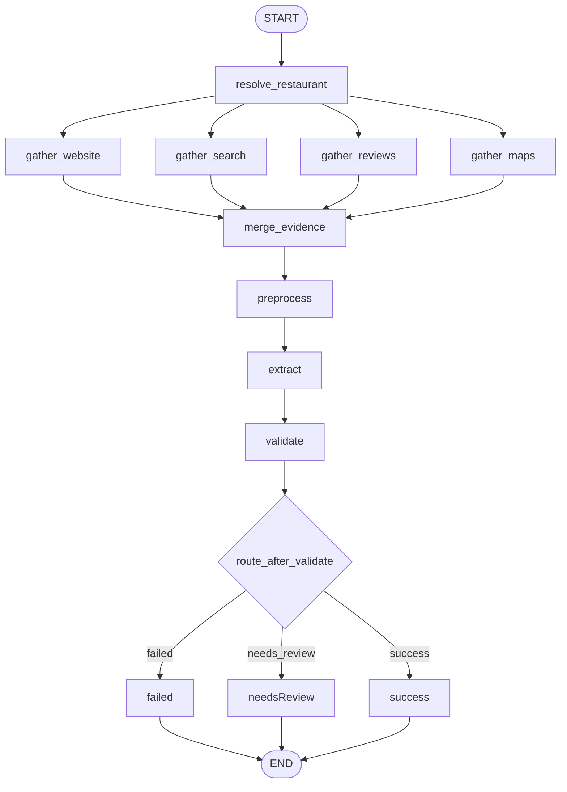
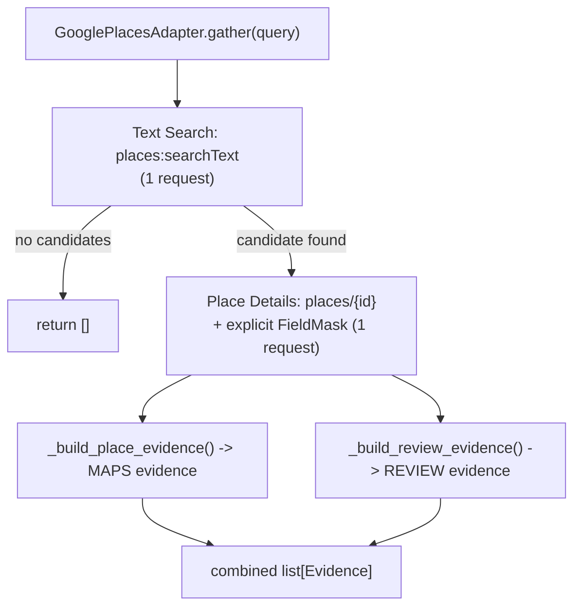

# Evidence Gathering

This document describes the parallel evidence gathering feature: how sources are queried, merged, and fed into the existing extraction pipeline.

## Overview

The `gather` CLI command accepts a restaurant **name** and **city**, collects evidence from multiple source adapters in parallel, merges and deduplicates snippets, then runs the same preprocessing → extraction → validation agent chain used by the CSV `run` command.

LangGraph fan-out/fan-in orchestration in `gather_graph.py` is the only gather orchestration path. An earlier thread-pool imperative backend was removed; see [ARCHITECTURE.md § Key design decisions](ARCHITECTURE.md#key-design-decisions).

## Architecture



The gather graph uses true LangGraph parallel branches. Each gather node writes to `source_results` via an `operator.add` reducer. Downstream agent nodes return partial state updates to avoid re-accumulating source results.

## Source adapters

| Adapter | Role | Behaviour |
|---------|------|-----------|
| `FakeSourceAdapter` | Tests, empty website slot | Returns canned evidence or raises when configured |
| `StaticSearchAdapter` | search, reviews, maps (default) | Loads snippets from JSON fixtures keyed by `name\|city` |
| `GooglePlacesAdapter` | maps (opt-in, replaces `StaticSearchAdapter` for that role only) | Live lookup against the official Google Places API (New) |

Fixtures live in `data/evidence_fixtures/` (`search.json`, `reviews.json`, `maps.json`). By default no live web scraping or live API calls happen at all; the Google Places adapter is opt-in via `--live --source google` (see below).

## Live Google Places adapter

`gather --live --source google` swaps the `maps` role from `StaticSearchAdapter` to `GooglePlacesAdapter` in `sources/factory.py::build_adapters()`. The `search`, `reviews`, and `website` roles are unaffected and remain static/fake. No changes were needed in `gather.py`, `gather_state.py`, `gather_graph.py`, or `evidence_merge.py` — `GooglePlacesAdapter` satisfies the same `SourceAdapter` protocol as every other adapter.

### Request flow

Exactly one Text Search request and one Place Details request are made per `gather()` call — never more, and never with a wildcard field mask:



Place Details FieldMask: `id,displayName,formattedAddress,googleMapsUri,websiteUri,outdoorSeating,rating,userRatingCount,reviews,reviewSummary,editorialSummary`.

### Evidence mapping

| Google Places field | Builder | `Evidence.source_type` | `Evidence.reliability` |
|---|---|---|---|
| `outdoorSeating: true` / `false` | `_build_place_evidence` | `MAPS` | `high` |
| `outdoorSeating` absent | `_build_place_evidence` | — (no evidence emitted) | — |
| `reviewSummary` | `_build_place_evidence` | `MAPS` | `medium` |
| `editorialSummary` | `_build_place_evidence` | `MAPS` | `medium` |
| `reviews[]` (up to `GOOGLE_PLACES_MAX_REVIEWS`, truncated to `GOOGLE_PLACES_REVIEW_SNIPPET_CHARS`) | `_build_review_evidence` | `REVIEW` | `low` |
| `rating` / `userRatingCount` | — | logged only (observability), not converted to evidence | — |
| `googleMapsUri` | — | used as `Evidence.url` (provenance) on the items above | — |
| `websiteUri` | — | used as `Evidence.url` (provenance) on the editorial-summary item only; **never fetched or crawled** | — |

All Google-sourced evidence uses `source_name="google_places"`. No new `EvidenceSourceType` enum value was added — `MAPS` and `REVIEW` are reused, matching how `static_maps`/`static_reviews` already provide those types.

`outdoorSeating` is captured twice: once as `MAPS` evidence text (above, for the LLM prompt) and separately as a raw `StructuredSourceAttributes.outdoor_seating` boolean on `SourceResult`, kept alongside — not instead of — the text evidence. The structured value is not shown to the LLM; it is used afterwards to cross-check the LLM's prediction. See [ARCHITECTURE.md § Structured validation and decision escalation](ARCHITECTURE.md#structured-validation-and-decision-escalation) for how this can escalate a record to `needs_review`.

### Safeguards

- One Text Search + one Place Details request per gather call — no retries, no pagination.
- Explicit FieldMasks only — never `"*"`.
- Configurable timeout (`GOOGLE_PLACES_TIMEOUT`, default 10s).
- HTTP access is isolated behind a `PlacesTransport` protocol; the real `HttpxPlacesTransport` uses a shared `httpx.Client`. Failures (`GooglePlacesError`) are caught by the existing `run_adapter_safe()` and become `SourceResult.error` — one failed live lookup never aborts the batch.
- `GOOGLE_PLACES_API_KEY` is only required when `--live --source google` is selected (`build_adapters()` calls `Settings.require_google_places_api_key()` at construction time in that branch only).

### Observability

Each successful `gather()` call emits one informational log block (search latency, candidate count, selected place summary, evidence-extracted checklist) via the module logger. This is logging only and never changes `Evidence`, `SourceResult`, or CSV output — see `sources/google_places.py::_log_summary()`.

### CLI usage

```bash
restaurant-agent gather --name "The River Cafe" --city "London" --live --source google
```

`--source` currently only accepts `google` and has no effect unless `--live` is also passed (passing `--source` without `--live` is a CLI usage error). See [README.md](../README.md#google-places-setup-optional-live-adapter) for setup.

## Data contracts

See `schemas.py`:

- `RestaurantQuery` — name, city, optional website URL hint
- `Evidence` — snippet with source type, URL, reliability metadata
- `SourceResult` — per-adapter outcome including optional error
- `GatheredEvidence` — deduplicated items plus aggregated errors

`GatherState` extends `AgentState` with gather-specific fields for LangGraph orchestration.

## Failure isolation

- Each adapter runs inside `run_adapter_safe()` — exceptions become `SourceResult.error`
- One failed source never aborts the batch or graph run
- If no evidence is gathered from any source, merge short-circuits with `error = "No evidence gathered from any source"` and skips the LLM call

## CLI usage

```bash
restaurant-agent gather --name "The River Cafe" --city "London" --dry-run
```

The existing CSV path is unchanged:

```bash
restaurant-agent --dry-run --limit 3          # backward compatible
restaurant-agent run --dry-run --limit 3      # explicit subcommand
```

## Output

Gather results are written to `outputs/gather_results.csv` with columns including source provenance:

- `source_evidence_snippets` — JSON list of gathered snippets
- `source_urls` — JSON list of source URLs (nullable entries)
- `source_types` — JSON list of source categories
- `gather_errors` — JSON list of per-source errors

## Testing

All gather tests — including the Google Places adapter — use `FakeSourceAdapter`, static fixtures, or a fake/mocked HTTP transport (`httpx.MockTransport`). No test contacts the network.

```bash
pytest tests/test_source_adapters.py tests/test_gather.py tests/test_evidence_merge.py
pytest tests/test_gather_graph.py tests/test_cli_gather.py
pytest tests/test_google_places_adapter.py
```

## Future extensions

- Additional live adapters (website fetch, search API, other map/review providers) behind explicit flags
- Additional Google Places candidate fields (opening hours, accessibility, payment methods, dog-friendly, reservations, parking, wheelchair access) via new `_build_*_evidence()` methods
- Semantic deduplication and conflict resolution
- Batch gather mode for multiple restaurants
