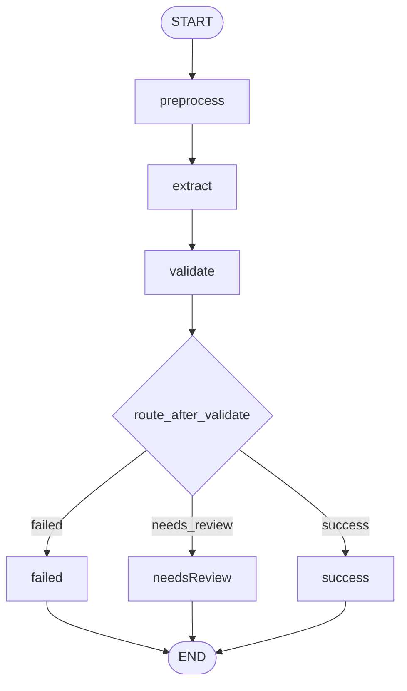

# LangGraph Orchestration

This document describes the LangGraph-backed orchestration layer used by the `run` command. Business logic in agents, preprocessing, validation, evaluation, prompts, and the Claude client lives outside this layer — `graph_pipeline.py` only wires that logic into a graph.

LangGraph is the only orchestration path for `run`; an earlier imperative backend was removed once the graph backend proved sufficient (see [ARCHITECTURE.md](ARCHITECTURE.md#key-design-decisions)). For the `gather` command's fan-out/fan-in graph, see [EVIDENCE_GATHERING.md](EVIDENCE_GATHERING.md).

## Design goals

- Use `AgentState` (Pydantic) directly as the LangGraph state — no duplicate `GraphState`.
- Expose orchestration via a `GraphPipeline` class with explicit node methods.
- Structure the graph for conditional routing to terminal nodes, so future hooks (metrics, retry, human-in-the-loop) have somewhere to attach.

## Architecture



### GraphPipeline class

```python
class GraphPipeline:
    def __init__(self, client: LLMClient, threshold: float) -> None: ...

    def preprocess_node(self, state: AgentState) -> AgentState: ...
    def extraction_node(self, state: AgentState) -> AgentState: ...
    def validation_node(self, state: AgentState) -> AgentState: ...
    def success_node(self, state: AgentState) -> AgentState: ...
    def needs_review_node(self, state: AgentState) -> AgentState: ...
    def failed_node(self, state: AgentState) -> AgentState: ...

    def route_after_validate(self, state: AgentState) -> str: ...
    def build(self) -> CompiledStateGraph: ...
```

Each agent node delegates to the existing `agents/*.run()` functions. Terminal nodes (`success`, `needs_review`, `failed`) are pass-through in the current PoC — they exist to demonstrate LangGraph routing and to host future logic (logging, metrics, human-in-the-loop hooks).

### State

`AgentState` from `state.py` is passed directly to `StateGraph(AgentState)`. No conversion layer.

### Batch orchestration

`run_graph_pipeline()`:

1. Loads records via `data_loader`.
2. For each record: seeds `AgentState`, invokes the compiled graph, collects the final state.
3. Reuses `_state_to_row`, `_write_csv`, `RESULT_COLUMNS`, and `evaluate_predictions` from `result_output.py`.

Per-record error isolation lives in `graph_pipeline._invoke_record`: unexpected exceptions are caught, recorded on `state.error`, and the batch continues.

## Routing logic

| Route | Condition |
|-------|-----------|
| `failed` | `validation_status == "failed"` |
| `needs_review` | `needs_review == True` (and not failed) |
| `success` | otherwise |

Terminal nodes return state unchanged.

## Test coverage

`tests/test_graph_pipeline.py` covers:

- Happy path (results + review queue)
- Error isolation (`ErrorClaudeClient`)
- `--limit` respected
- Graph node unit test via `GraphPipeline.build().invoke()`

## Scope limits

- **Over-engineering**: processing is linear with routing scaffolding only; no async, fan-out, or retry nodes for the `run` command (the `gather` command's graph does fan out — see [EVIDENCE_GATHERING.md](EVIDENCE_GATHERING.md)).
- **State drift**: shared row/CSV helpers live in `result_output.py`; both `graph_pipeline.py` and `gather_graph.py`'s underlying helpers import from there rather than duplicating CSV/evaluation logic.
- **Pydantic + LangGraph**: slightly less performant than TypedDict; acceptable for a batch CLI PoC.
