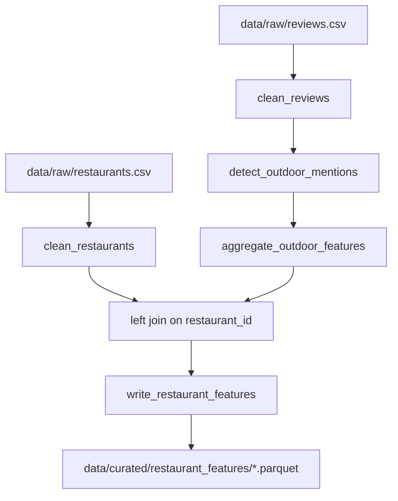

# Spark Pipeline

A standalone batch data-engineering layer that computes outdoor-seating
features from raw restaurant/review CSVs using deterministic keyword
matching, and writes a curated Parquet dataset. It runs entirely separately
from the LangGraph agent (`graph_pipeline.py` / `gather_graph.py`) — no
LLM calls, no shared state, no coupling. It exists to demonstrate a
distributed-processing-compatible ingestion/feature pattern per
[CLAUDE.md's Data Pipelines guidance](../CLAUDE.md), and to produce a
second, complementary evidence signal that a future iteration of the agent
could consume alongside its existing LLM-derived predictions.

## Why Spark here (not Polars/pandas)

The rest of this repo's LLM pipeline uses pandas for small CSV batches —
appropriate at that scale. This module is scoped specifically to demonstrate
patterns that carry over unchanged to a real multi-node cluster:

- **Schema-on-read** (`pipelines/schemas.py`) instead of type inference.
- **Catalyst-optimized SQL expressions** for feature extraction
  (`regexp_extract_all`, `min_by`) instead of row-at-a-time Python.
- **Partitioned, columnar output** (Parquet) instead of a flat CSV.

These patterns are what actually change when a dataset outgrows one
machine; pandas/Polars code generally does not transfer to a cluster
without a rewrite. This is a deliberate, scoped choice for this one batch
job — not a stack-wide migration away from Polars/pandas.

## Why deterministic feature engineering complements the LLM pipeline

The LangGraph agent's extraction is qualitative and reasoning-based: it
reads unstructured evidence text and produces a judgment with a confidence
score and rationale. That is powerful but comparatively expensive and
non-deterministic (the same input can, in principle, yield a different
LLM call each run).

This Spark pipeline is the opposite by design: given the same CSVs, it
always produces the same output. It is cheap to run at scale, fully
explainable (every score traces back to a documented formula and a
specific matched review), and requires no API calls. Evidence-first design
means a fast, deterministic signal like this is valuable in its own right,
not just as a shortcut — it is well suited to producing a first-pass or
tie-breaking structured signal, or to pre-filtering a large restaurant
catalogue before more expensive LLM evidence-gathering is spent on
borderline cases.

## Architecture



## Data contracts

`data/raw/restaurants.csv` (`pipelines/schemas.py::RESTAURANTS_SCHEMA`):

| Column | Spark type | Notes |
|---|---|---|
| `restaurant_id` | `StringType` | join key |
| `name` | `StringType` | display name |
| `cuisine` | `StringType` | free text, cleaned to Title Case |
| `city` | `StringType` | cleaned to Title Case |
| `area` | `StringType` | neighbourhood/district, optional |
| `rating` | `DoubleType` | 0.0–5.0 |
| `review_count` | `IntegerType` | non-negative |
| `price_level` | `IntegerType` | 1–4 |
| `latitude` | `DoubleType` | -90..90 |
| `longitude` | `DoubleType` | -180..180 |

`data/raw/reviews.csv` (`pipelines/schemas.py::REVIEWS_SCHEMA`):

| Column | Spark type | Notes |
|---|---|---|
| `review_id` | `StringType` | row identifier |
| `restaurant_id` | `StringType` | FK to restaurants |
| `review_text` | `StringType` | source of outdoor evidence |

Spark's CSV reader treats `nullable` as documentary metadata only — a value
that fails to cast (e.g. `"abc"` into a `DoubleType` column) becomes `null`
for that cell, not a parse error or a dropped row. Real validation happens
in `clean.py` below.

## Cleaning rules (`pipelines/clean.py`)

`clean_restaurants`: trims whitespace and collapses internal whitespace on
`name` (case preserved); Title-Cases `cuisine`/`city`/`area`; nulls (rather
than guesses) out-of-range values — `rating` outside `[0,5]`,
`review_count < 0`, `price_level` outside `{1,2,3,4}`, `latitude` outside
`[-90,90]`, `longitude` outside `[-180,180]`; drops rows with a blank/null
`restaurant_id`.

`clean_reviews`: trims and collapses whitespace on `review_text` — case and
punctuation are otherwise preserved exactly, so matching stays accurate and
`sample_outdoor_evidence` is a verbatim, traceable quote; drops rows with a
blank/null `review_id` or `restaurant_id`; null/empty `review_text` is
allowed through (it means "no signal", not an error).

## Outdoor-seating detection (`pipelines/features.py`)

Nine required phrases, matched case-insensitively: `outdoor seating`,
`terrace`, `patio`, `garden`, `courtyard`, `outside tables`,
`sea view terrace`, `rooftop`, `al fresco`.

Matching uses Spark SQL's `regexp_extract_all` — a single generated regex
alternation — rather than a Python UDF:

- **Explainability**: the whole vocabulary is one named tuple and one
  regex string, inspectable and unit-testable in isolation.
- **Performance**: SQL expressions are whole-stage-codegen'd and run inside
  the JVM; a UDF forces row-by-row (de)serialization across the
  JVM↔Python boundary and defeats Catalyst optimization.
- **Determinism**: pure expressions, no closures, no external state.

### Confidence formula

```
mention_ratio  = outdoor_review_mentions / total_reviews          (0.0 if total_reviews == 0)
volume_factor  = min(1.0, total_reviews / 5)
outdoor_confidence_score = round(mention_ratio * volume_factor, 2)
has_outdoor_seating_inferred = outdoor_confidence_score >= 0.3
```

`volume_factor` exists so that a single anecdote never reads as certain: a
restaurant with one review that mentions a patio would otherwise score a
false-certain `1.0`. Confidence is discounted until 5 or more reviews
corroborate the signal — directly in service of "unknown is preferable to
incorrect."

| total_reviews | outdoor mentions | mention_ratio | volume_factor | confidence | inferred? |
|---|---|---|---|---|---|
| 3 | 2 | 0.667 | 0.6 | 0.40 | True |
| 1 | 1 | 1.000 | 0.2 | 0.20 | False (single anecdote, not enough volume) |
| 5 | 2 | 0.400 | 1.0 | 0.40 | True |
| 0 | 0 | 0.000 | 0.0 | 0.00 | False (no reviews at all) |

`sample_outdoor_evidence` is chosen deterministically via `min_by` on
`review_id` among matching reviews only — a stable, traceable verbatim
quote, not an arbitrary row from an unordered group-by.

### Known limitation: no negation handling

This is literal phrase matching, not NLP. A review saying **"no patio"** or
**"the outdoor seating was closed"** still counts as a mention, because the
phrase is present regardless of the surrounding negation. This is an
intentional, acknowledged simplification for this PoC's stated scope
("keyword and phrase matching") — not a bug, and not fixed by this
pipeline. A production version would need negation-aware NLP (e.g. a
dependency-parse check or a small classifier) before this signal could be
trusted at higher confidence thresholds.

## Output schema

Final column order written to `data/curated/restaurant_features/`:

```
restaurant_id, name, cuisine, city, area, rating, review_count, price_level,
latitude, longitude, total_reviews, outdoor_review_mentions,
outdoor_confidence_score, has_outdoor_seating_inferred, sample_outdoor_evidence
```

Restaurants with zero matching reviews (or zero reviews entirely) still
appear exactly once, via a left join, with `total_reviews=0`,
`outdoor_review_mentions=0`, `outdoor_confidence_score=0.0`,
`has_outdoor_seating_inferred=False`, `sample_outdoor_evidence=null`.

## CLI usage

```bash
python -m restaurant_agent.pipelines.build_restaurant_features \
    [--raw-dir data/raw] [--output-dir data/curated/restaurant_features]
```

Prints a run summary: restaurants processed, reviews processed, restaurants
inferred to have outdoor seating, restaurants with no reviews, reviews
containing outdoor-seating phrases, and the output location.

## Loading the curated output (example)

The curated Parquet dataset is a standalone artifact — any component that
can read Parquet can consume it. This is a plain read-only example showing
the intended interface; it is **not** wired into the LangGraph agent yet.

With pandas (no Spark dependency needed to just read the output, but it
does need a Parquet engine: `pip install pyarrow`):

```python
import pandas as pd

features = pd.read_parquet("data/curated/restaurant_features")
outdoor_candidates = features[features["has_outdoor_seating_inferred"]]
print(outdoor_candidates[["restaurant_id", "name", "outdoor_confidence_score"]])
```

With PySpark (e.g. from another Spark job):

```python
from restaurant_agent.pipelines.spark_session import build_spark_session
from restaurant_agent.pipelines.write import read_restaurant_features

spark = build_spark_session()
features = read_restaurant_features(spark, "data/curated/restaurant_features")
features.filter(features.has_outdoor_seating_inferred).show()
```

## Feeding the LangGraph agent (future integration path — not implemented)

This section describes a plausible next step; nothing here has been wired
into the graph. `schemas.py::StructuredSourceAttributes` and
`structured_validation.py::validate_outdoor_seating` already implement the
pattern of cross-checking an LLM prediction against a structured
attribute — this is the same mechanism used today for the Google Places
adapter's `outdoorSeating` boolean (see
[docs/ARCHITECTURE.md § Structured validation and decision escalation](ARCHITECTURE.md#structured-validation-and-decision-escalation)).

A future loader could read the curated Parquet, look up a restaurant by
`restaurant_id`, and attach `has_outdoor_seating_inferred` /
`outdoor_confidence_score` as one more `SourceResult.structured_attributes`
value alongside the existing evidence sources — requiring no changes to
`GatherState`, `evidence_merge.py`, or the graph shape, mirroring how the
Google Places adapter itself required no core changes. For the plain `run`
CSV path, `data_loader.py::to_initial_state()` could similarly join
curated features onto `AgentState` before the graph runs. Both are
described here as a possible direction, not built.

## Testing

```bash
pip install -e ".[dev,spark]"
pytest tests/pipelines/test_features.py
```

`tests/pipelines/conftest.py` guards the whole subpackage with
`pytest.importorskip("pyspark")`, so a plain `pytest` run without the
`spark` extra installed skips these tests cleanly instead of failing
collection for the rest of the suite.

## Future extensions

- Additional attributes beyond outdoor seating (accessibility, hours).
- Partitioning curated output by `city` for larger catalogues.
- Incremental/merge writes instead of full overwrite.
- Data-quality checks (e.g. row-count/null-rate assertions per run).
- Actually implementing the LangGraph integration path described above.

## Scope limits

- `local[*]` only — no cluster configuration.
- `coalesce(1)` output: a single Parquet part-file, for PoC readability —
  not a production partitioning strategy.
- Literal keyword matching only: no negation handling, no NLP.
- Hand-crafted 8-restaurant/14-review sample data — not representative of
  production scale.
- Full-overwrite writes only; no incremental/merge logic. Note this means each run deletes and recreates `data/curated/restaurant_features/`, including any unrelated files placed there directly (e.g. a manually added `.gitkeep`).
